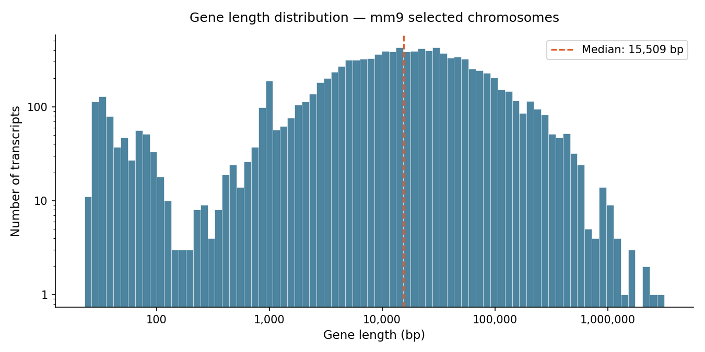

# mm9-mouse-genomic-analysis

This is Python pipeline for exploratory analysis of gene annotations and chromosomal
sequences from four selected chromosomes of the *Mus musculus* mm9 genome build.
Covers gene counting, sequence extraction, length statistics, coding/non-coding
quantification, and TATA box motif detection near transcription start sites.

---

## Repository structure

```
.
├── Main_file.py              # Analysis pipeline (Spyder cell-based)
├── LoadFASTA_Function.py     # Utility functions: LoadFastaFile, LoadGene, TSSChroms
├── mm9_sel_chroms_knownGene.txt   # Gene annotation table (UCSC knownGene format)
└── selChroms_mm9.fa.zip      # Chromosomal sequences in zipped FASTA format
                              # (download link in Input Files section below)
```

---

## Dependencies

**Standard library** (no installation needed): `csv`, `gc`, `io`, `zipfile`

**Third-party:**

```bash
pip install numpy matplotlib
```

| Package | Purpose |
|---|---|
| `numpy` | Boolean array operations for coding region analysis; gene length statistics |
| `matplotlib` | Gene length histogram with log-scaled axes |

---

## Input files

### 1. Gene annotation — `mm9_sel_chroms_knownGene.txt`
Tab-delimited table in UCSC knownGene format. Each row is one transcript and
provides the identifier, chromosome, strand, and transcript/CDS start–end
coordinates. The dataset covers four chromosomes and **10,674 transcripts** in total.

### 2. Chromosomal sequences — `selChroms_mm9.fa.zip`
Zipped FASTA file containing the raw nucleotide sequences for each chromosome.
Download from Google Drive before running the pipeline:

> https://drive.google.com/file/d/1jxOqX3W5Dsdhlr0Q3i2_oeujS7AJ3D2K/view?usp=drive_link

Place the downloaded `.zip` file in the same directory as `Main_file.py`.
Loading this file is the most memory-intensive step (~1–3 minutes depending on RAM).

---

## How to run

1. Clone or download this repository.
2. Download `selChroms_mm9.fa.zip` from the link above and place it in the project folder.
3. Run the pipeline:
   - **From the terminal:** `python Main_file.py`

The pipeline writes two output files on completion:
- `gene_length_distribution.png` — histogram of transcript length distribution
- `genomic_analysis_report.txt` — plain-text summary of all computed results
 
---

## Pipeline overview

### 1 · Load gene annotations
`LoadGene()` reads the knownGene table into a dictionary keyed by transcript ID.
Each entry stores chromosome, strand, transcript start, and transcript end.

```python
gene_inf['uc009auw.1']['chr']
# 'chr6'
```

### 2 · Gene counts per chromosome
Unique chromosomes are collected from the annotation dictionary, then transcripts
are tallied per chromosome.

| Chromosome | Transcripts |
|---|---|
| chr6  | 2,990 |
| chr11 | 3,899 |
| chr15 | 2,110 |
| chr16 | 1,675 |
| **Total** | **10,674** |

### 3 · Load chromosomal sequences
`LoadFastaFile()` reads the zipped FASTA into a dictionary of strings keyed by
chromosome name. Chromosome 6 is 149,517,037 bp long.

```python
len(seq_dict['chr6'])
# 149517037
```

### 4 · Extract a gene sequence — Cntn4
Cntn4 (contactin-4, transcript `uc009dcr.2`) is extracted as a slice of the
chr6 string using its annotated coordinates.

| Field | Value |
|---|---|
| Chromosome | chr6 |
| Start | 105,627,738 |
| End | 106,624,264 |
| Transcript length | 996,526 bp |

```python
cntn4_seq = seq_dict[cntn4_chr][cntn4_start:cntn4_end]
cntn4_seq.index('ATG')   # position of first start codon within the transcript
```

### 5 · Gene length distribution
Transcript span (`txEnd − txStart`) is computed for all 10,674 transcripts.
Because lengths span several orders of magnitude, the histogram uses log-scaled
axes on both x and y. A dashed line marks the median.

| Statistic | Value |
|---|---|
| Mean length   | 45,343 bp |
| Median length | 15,509 bp |
| Shortest      | 23 bp |
| Longest       | 3,171,331 bp (~3.2 Mb) |

> The large gap between mean and median reflects the long tail of very large
> genes — a common feature of mammalian genomes.



### 6 · Coding vs. non-coding DNA — chromosome 6
A boolean NumPy array of length equal to the maximum annotated coordinate on
chr6 is used to mark every base position covered by at least one transcript.
Overlapping transcripts are counted only once (setting an already-`True` index
to `True` is idempotent).

| Measure | Value |
|---|---|
| Coding bp       | 67,695,635 |
| Non-coding bp   | 81,811,744 |
| Coding fraction | 0.4528 (45.3%) |

```python
coding_bp   = ingene_numpy.sum()          # 67,695,635
noncoding_bp = len(ingene_numpy) - coding_bp  # 81,811,744
coding_frac  = coding_bp / len(ingene_numpy)  # 0.4528
```

### 7 · TATA motif search near transcription start sites
`TSSChroms()` extracts the TSS position for every chr6 transcript, accounting
for strand direction. A 40 bp window immediately upstream of each TSS (or
downstream for minus-strand genes) is then searched for the canonical TATA box
sequence. Genes where the motif is found are stored with its offset within the
window as a proxy for distance from the TSS.

```python
# Mean distance of TATA motif from TSS across all chr6 genes where it was found:
mean_tata_dist = sum(tata_dis.values()) / len(tata_dis)
```

---

## Output files

| File | Description |
|---|---|
| `gene_length_distribution.png` | Log-scaled histogram of transcript lengths across all four chromosomes |
| `genomic_analysis_report.txt`  | Structured plain-text summary of all results, datestamped at runtime |

---

## Notes on extensibility

The pipeline uses three named constants at the top of `Main_file.py` that
control all file paths and the TATA search window:

```python
GENE_FILE  = 'mm9_sel_chroms_knownGene.txt'
FASTA_FILE = 'selChroms_mm9.fa.zip'
WINDOW     = 40   # bp upstream/downstream of TSS
```

To apply this analysis to a different genome or a wider motif search window,
only these three lines need to change. The annotation file must follow the UCSC
knownGene tab-delimited format; the FASTA file may be plain or zipped.
